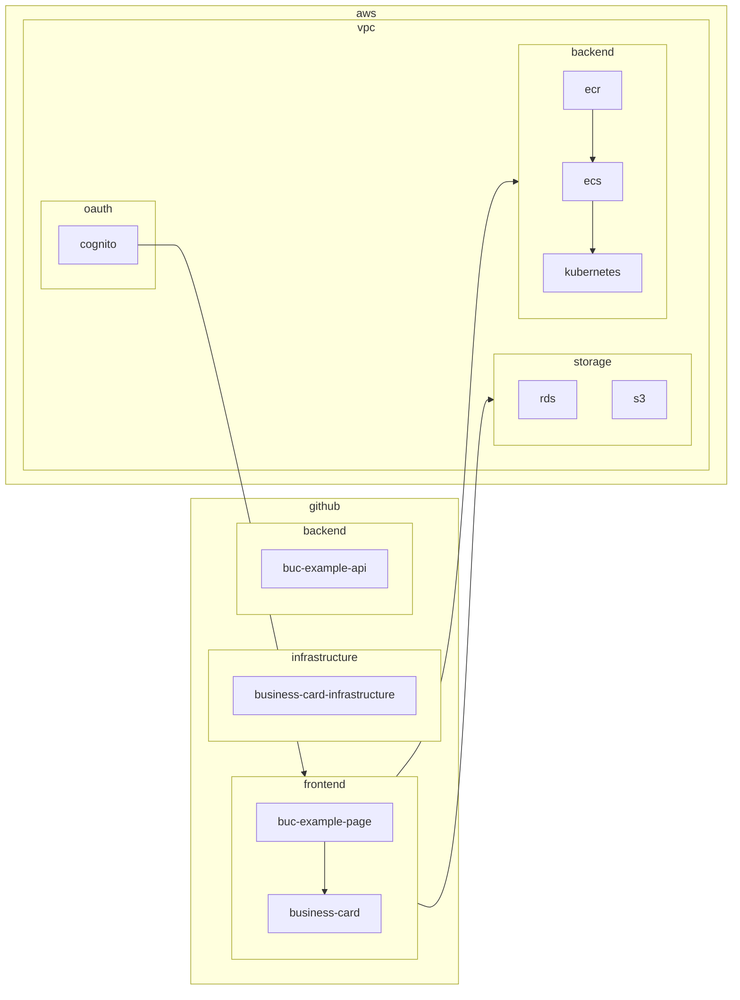

# Business Card

## Background

This series of repositories with prefix `business-card` should serve as my portfolio to demonstrate my skills and interesting ideas. It should extend the content of repositories like `zcemycl.github.io`, `practice-app` and `webpack-ts-mpa-example`, etc.

## Separation of concerns

- Frontend
  - business-card
  - business-card-private
  - business-card-prototype
  - business-card-react
  - business-card-next
  - business-card-{framework}
  - business-card-uiux-design
- Backend
  - business-card-backend
  - business-card-home-backend
- Infrastructure
  - business-card-infra
  - business-card-home-infra
- Database
  - business-card-core
  - business-card-etl
- Others
  - business-card-{npm-package}
  - business-card-{pypi-package}

## Coding Standards

- Frontend
  - React + Typescript
  - Javascript + Typescript
    - More customised designs
  - Jest
  - Cypress for e2e testing
  - Prettier - Code formatter
  - Testid?
  - Redux + Reducer
  - React-GA (User Activity Tracker?)
  - Test Dev Stage Prod
  - env-cmd?
  - Tour
  - Webpack
  - Bootstrap + MUI + Styled Components
  - Dynamic Page Recommendation?
- Backend
  - Python
    - Pytest
    - Packaging
    - pylint
    - isort
    - black
    - flake8
  - Nodejs
  - C++
  - C#
- Infrastructure
  - Terraform
    - AWS
      - amplify
      - rds, dynamodb
      - eks? ecr, ecs
    - Modules
    - Dev + Prod Folder to link modules
- Database
  - SQLite
    - Prototyping
  - MariaDB
    - User Pool
    - Page Rank
  - PostgreSQL
  - Neo4J
    - Fun
  - PySpark for recommendation system

## Architectures

