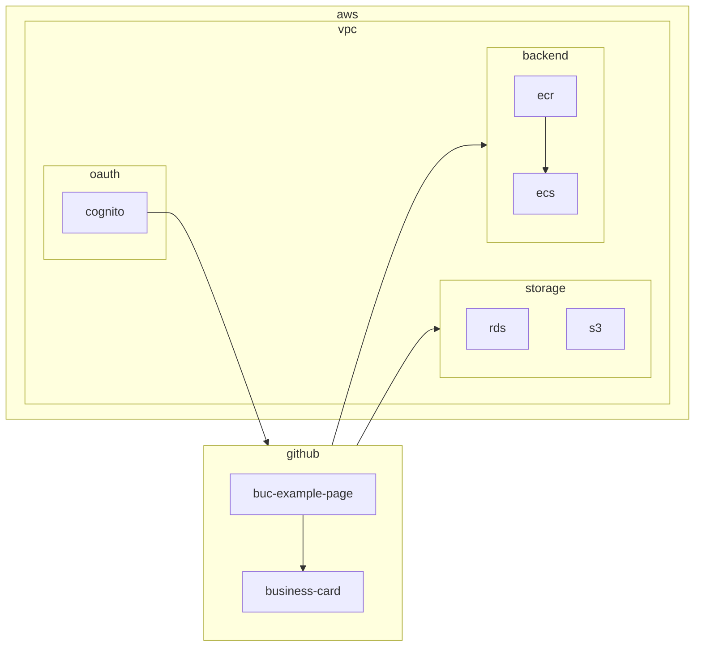

# Business Card
This repo is to improve [zcemycl/practice-app](https://github.com/zcemycl/practice-app) with good practices learnt from [zcemycl/webpack-react-ts-mpa-example](https://github.com/zcemycl/webpack-react-ts-mpa-example) and others to develop more functional webpages.

## Relevant Repos
- Frontend
    - [zcemycl/business-card](https://github.com/zcemycl/business-card)
- Backend
    - Coming Soon?
- Infrastructure
    - Coming Soon?

## Coding Standards
- Frontend
    - Jest
    - Cypress for e2e testing
    - Prettier - Code formatter
- Backend
    - Python 
        - Pytest
        - Packaging
    - Nodejs
    - C++
    - C#
- Infrastructure
    - Terraform 
    - AWS

## Architectures

